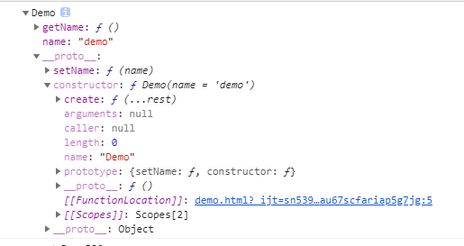
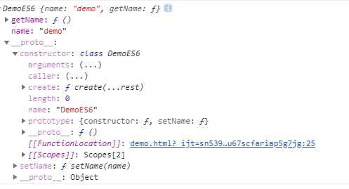

# 构造函数

> 了解何为构造函数, 以及它们的特点

## 什么是构造函数

**构造函数**: 在 Javascript 中一切皆是对象, 而**构造函数**是可以通过`new`操作符实例化生成对象的函数,
是对象的模板 , 是表现某一类对象的共同特征.

## 构造函数的基本结构

```javascript
// 构造函数

// ES5
function Demo(name = 'demo') {
  this.name = name
  this.getName = function() {
    console.log('My name`s ' + name)
  }
}

Demo.prototype.setName = function(name) {
  this.name = name
}

Demo.create = function(...rest) {
  return new Demo(...rest)
}

const instance = new Demo()
console.log(instance) // 见图一

// ES6
class DemoES6 {
  constructor(name = 'demo') {
    this.name = name
    this.getName = function() {
      console.log('My name`s ' + name)
    }
  }
  setName(name) {
    this.name = name
  }

  static create(...rest) {
    return new Demo(...rest)
  }
}

const instanceES6 = new DemoES6()
console.log(instanceES6) // 见图二
```

 

以上就是一个构造函数, 它具有构造函数的基本结构

- 实例(私有)方法/属性: `name`, `getName`. 每个实例都单独有具有该方法/属性
- 原型(公有)方法/属性: `setName`. 实例并不具有该方法, 该方法在原型`prototype`中才有
- 静态(构造)方法/属性: `create`. 构造方法独有, 跟实例没有关系

## `instanceof`

```javascript
console.log(instance instanceof Demo) // true
console.log(instance instanceof Object) // true
console.log(instance.__proto__ === Demo.prototype) // true
```

> `instanceof` **运算符**用于检测构造函数的`prototype`是否出现在实例对象的原型链中

## 构造函数的特点

- 是一个函数, 基本上所有的函数都可以作为构造函数(PS: 不包括箭头函数)
- 可以通过`new`**操作符**进行实例化
- 有构造方法`constructor` 即 `Demo.constructor`
- 有原型对象`prototype` 即 `Demo.prototype`
- 一般默认首字母大写, 与普通函数区分

## `class` EcmaScript6 - EcmaScript 2015

> `ES5`和`ES6`只是写法不一样, 其实本质一样, `ES6`中的`class`本质是`ES5`构造函数的语法糖

详见
:[Babel · The compiler for next generation JavaScript](https://babeljs.io/repl#?browsers=&build=&builtIns=false&spec=false&loose=false&code_lz=MYGwhgzhAEAiCmBbA9gUQMoDZoG8BQ00wyAdhAC4BOArsOcpQBQliLzQC80A5ACZLJuASlwFC0cgAsAlhAB0LNp2iL4YwlNlyA5vHIA5Vuy4AzaiTrTSjEfnHjiZZCHhyQybY24BZAJ4qjAAMYbmgAagC2IXVoAF8xeMIIPUM2ZiNbGM15VWVVBLwxCjByaWAiSngS-EY5OsqKTPtK8mpKEhV4AHc4AVr6-EaC2KA&debug=false&forceAllTransforms=false&shippedProposals=false&circleciRepo=&evaluate=false&fileSize=false&timeTravel=false&sourceType=module&lineWrap=true&presets=es2015&prettier=true&targets=&version=7.9.6&externalPlugins=)
ES6 转译之后的 ES5 之后的代码

```javascript
// 这里截取部分展示
function _defineProperties(target, props) {
  for (var i = 0; i < props.length; i++) {
    var descriptor = props[i]
    descriptor.enumerable = descriptor.enumerable || false
    descriptor.configurable = true
    if ('value' in descriptor) descriptor.writable = true
    Object.defineProperty(target, descriptor.key, descriptor)
  }
}
function _createClass(Constructor, protoProps, staticProps) {
  if (protoProps) _defineProperties(Constructor.prototype, protoProps)
  if (staticProps) _defineProperties(Constructor, staticProps)
  return Constructor
}

var DemoES6 = /*#__PURE__*/ (function() {
  function DemoES6() {
    var name = arguments.length > 0 && arguments[0] !== undefined ? arguments[0] : 'demo'

    _classCallCheck(this, DemoES6)

    this.name = name

    this.getName = function() {
      console.log('My name`s ' + name)
    }
  }

  _createClass(
    DemoES6,
    [
      {
        key: 'setName',
        value: function setName(name) {
          this.name = name
        }
      }
    ],
    [
      {
        key: 'create',
        value: function create() {
          for (var _len = arguments.length, rest = new Array(_len), _key = 0; _key < _len; _key++) {
            rest[_key] = arguments[_key]
          }

          return _construct(Demo, rest)
        }
      }
    ]
  )

  return DemoES6
})()
```

## 总结

> 构造函数是一个可以通过`new`操作符进行实例化生成对象的是一个拥有构造方法和原型对象的函数, 是对象的
> 模版.

## 参考文档

- [构造方法 - JavaScript | MDN](https://developer.mozilla.org/zh-CN/docs/Web/JavaScript/Reference/Classes/constructor)
