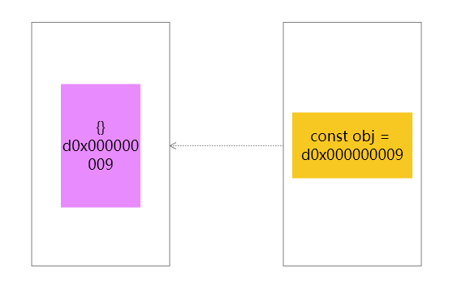

# Javascript 中的数据存储

## 数据类型

> Javascript 中一般数据类型分两种, 一种`基础数据类型`, 一种`引用数据类型`

基础数据类型: `String`, `Number`, `Boolean`, `Symbol`, `Bigint`, `undefined`, `null`

引用数据类型: `Object`, `Array`, `Function`, `Date` `Set`, `Map`

## 存储方式

为什么一个叫基础数据类型, 一个叫引用数据类型. 原因就是它们两的存储方式不同.

众所周知, Javascript 中数据存储在两个地方, 一个是堆`heap`一个是栈`stack`

数据存储在栈`stack`中就可以认为它是`基础数据类型`

数据存储在堆`heap`中就可以认为它是`引用数据类型`

有一张很经典的讲事件循环的图(图一), 其中就有堆跟栈


## 引用数据类型

虽然`引用数据类型`的数据时存储在 heap 中, 但其实它的定义和使用其实是在栈中, 在栈中存储的是堆中的引用
地址

定义一个变量`const obj = {}`流程如下:

1. 在 heap 中生成一个对象它的引用地址是`d0x000000009`
2. 在 stack 中声明一个变量`obj = d0x000000009`
3. 当`obj`被使用的时候, 其实它调用的是`d0x000000009`这个内存地址中的数据
4. 当 stack 中的引用被移除是, heap 的数据如果没有被第三方引用, 这数据被清除



## 基础数据类型

相对而言, 基础数据类型直接在 stack 中声明和存储, 它的整个生命周期都在 stack 中

## const

```javascript
const num = 1
num++ // Uncaught TypeError: Assignment to constant variable.

const obj = { name: 'demo' }
obj.name = 10 // it work.
```

这也是为什么使用`const` 关键字定义的对象可以修改的原因. 对于 obj 来说它在栈中只保存了引用地址, 只要
这个地址没变, 对于它来说就是没有变化, 至于堆中的对应数据是否发生变化, 这个并不违反`const`关键字的原
则.

## 举个简单例子

引用数据类型: A 地上班, 住在 B 地

基础数据类型: A 地上班, 住在 A 地

## 总结

在 Javascript 中每一个数据都需要一个内存空间. 内存空间又分为两种, `栈内存(stack)`和`堆内存(heap)`,

基础数据类型存储在`栈内存(stack)`中

引用数据类型存储在`堆内存(heap)`
